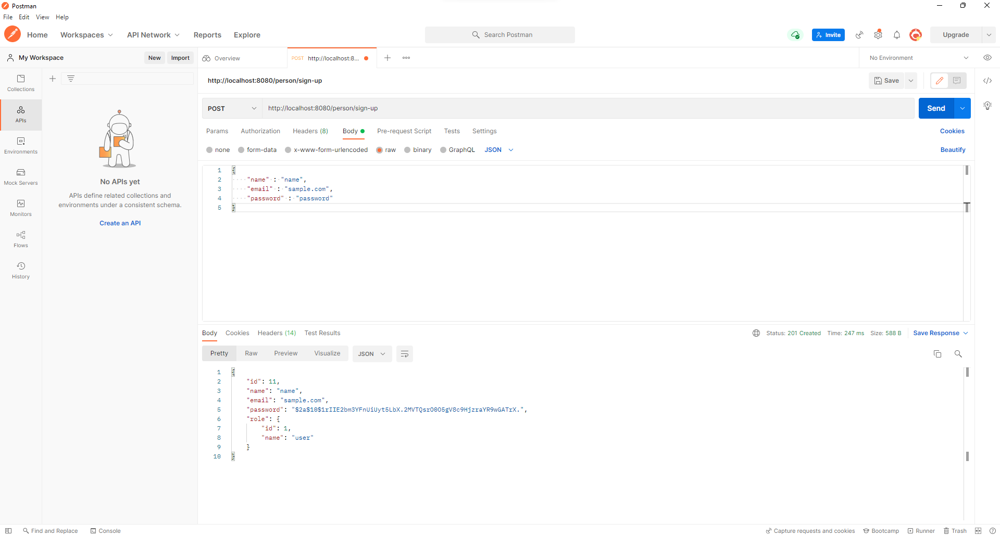
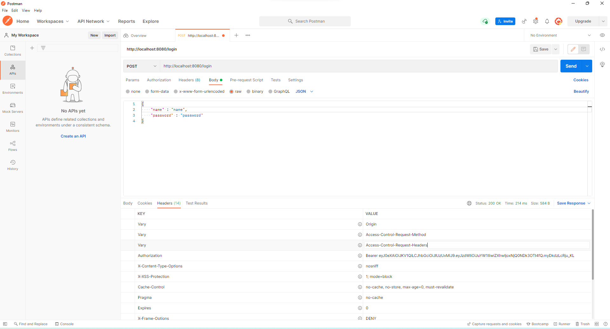
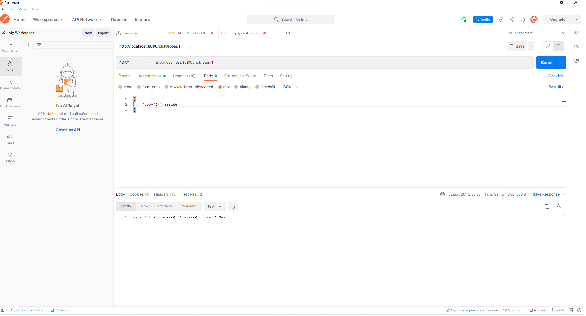
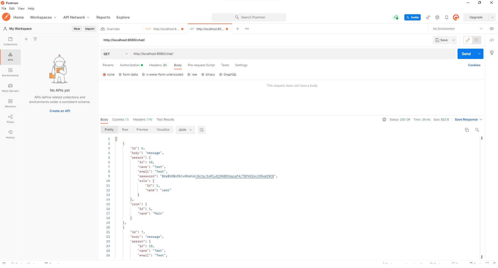
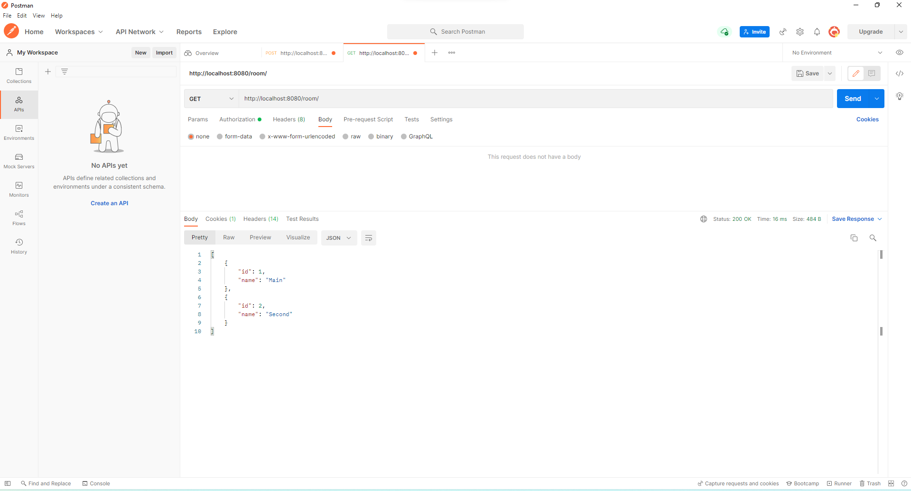

Chat
=============

### Description
This project is the REST API chat service. 

### Used technologies:
1. Spring Boot
2. Spring Data
3. Spring Security
4. PostgreSQL
5. JWT
6. Liquibase

### Functionality
Here are some of the core functions:

Registration

Authorization

Send message

Get all messages

Get all rooms

